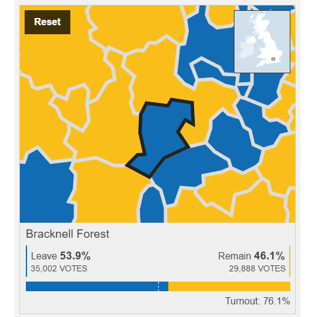

+++
author = "Steve Bennett"
date = 2016-06-25T08:09:49Z
description = ""
draft = false
slug = "living-in-the-echo-chamber"
title = "Living in the Echo Chamber"
+++

Yesterday was a momentous day in British history.

It was the day after the EU Referendum, and the day we all found out that the people of Britain had [voted in favour of leaving the European Union](http://www.bbc.co.uk/news/politics/eu_referendum/results). I’ve never been affected by the result of an election as much as I was yesterday. Britain felt different, and I didn’t feel part of it. I voted Remain, but it’s not the way I voted which I feel compelled to write about.

I woke to the news of the result at 5.30am. Jo (my wife) got out of bed before me, and I flicked on the TV. It’s my usual routine to listen to the news headlines as Jo gets ready to go to the gym.

Before I went to bed, I knew that there'd be a good chance that we'd be waking up to a result, however my groggy head wasn't prepared for the news that I heard. David Dimbleby was explaining that with the votes already counted, the BBC were predicting that the Leave Campaign would win by a small margin. Within the next half an hour, and as I showered, and tucked into breakfast, the official result came through. Britain had decided to Brexit.



To me this came as a shock. I knew that the vote was expected to be close, but I thought that in the end people would decide to Remain.

It was at this point that I started to consider the campaign I'd been exposed to over the previous month. I'd seen the [newspaper headlines](http://www.bbc.co.uk/news/blogs-the-papers-36572865), I'd watched the [political broadcasts](http://www.bbc.co.uk/programmes/b07d6g8y) and I'd heard the reports from the campaigns on the [radio](http://www.bbc.co.uk/programmes/p03rdks3). I knew that there were people across the country supporting the Leave Campaign, yet they weren’t represented in my social circles.

My Facebook feed was largely devoid of Leave supporters. The same for my Twitter feed. The news articles I read only added to the sentiment that the remain vote would win out, and that those backing any form of Brexit were crazy, and their campaign was based on misinformation and fear.

Following the result, the rallying pro-Remain posts on my social feed were replaced with people expressing their sadness, disappointment and fear over the result and what was to follow. A few people joked (I think) about leaving the country. I joked about leaving the country (Still not sure - I think it was a joke).





I didn't see anyone celebrating the Leave victory. Not one person on Facebook. I had to check the trending topics on Twitter in order to find some traces of victory. It was at this point that something really started to hit home. Something about my place on social media which worries me. I'm living in an echo chamber.

People like people like themselves. Social networks, such as Twitter and Facebook only further encourage this behaviour. Personally, I don't follow people I disagree with. I certainly don't "Like" people on Facebook whose views are at odds with mine. The consequence is that my feeds are full of people like me. People living and working in technology. People who live in London (a place where people voted to remain) or other affluent parts of the UK. Or affluent parts of the US. People who have been largely (luckily) unaffected by the 2008 financial crisis. People who are not on benefits. People who have not been affected by George Osbourne's austerity budgets. People who shop at Waitrose. People who are not “old”.



I'm not even connected to my local community, as my local council decided to vote in favour of Leave 54% to 46%.

As I write this, I know that this isn't right.

In order to be a better citizen of this wonderful Island, heck to be better person, I need more diversity in my networks. I need more opinions, even if I don't agree with them. I need to vary the places I get my information from. I need to be able to see things from someone elses vantage point.

The more I think of this, the more I believe it is something that we should all strive to do. We all know that having a balanced diet is good for you. The same thing applies to where you get your information from.

But how can I do this? I can do my bit by "following" or "liking" people and news outlets I don't agree with. Yet in doing so, what signal does this send off about me? I don't "like" what the Daily Mail is printing, and I don't "follow" Donald Trump. The side-effects of the verbs used, and the social norms of the networks make it difficult to pull in these viewpoints. Yet, I feel it’s something I need to do. So, if you get concerned when you see “Steve liked The Daily Mail”, don’t be – I’m just trying to add some balance.

The question is, should it just be up to me to add this balance?

Facebook knows so much about me. They know what I like, what causes I follow, how I react to the opinions of others. They use this knowledge to tailor the experience on the platform, so that I see more of the things I “like” and less of the stuff I don’t. Perhaps there’s an argument that, in order for me to be a more rounded individual, Facebook should also show some posts from the opposing view point.

For Facebook, it’s a tough decision to make. Am I going to continue to open the app (and view the ads) if every time I do I see things which I disagree with. Their user research probably shows not. Yet I feel, that for the good of our society, users need to be made aware of the social echo chamber which they exist.

I’m not the only one feeling this way. As I travelled back home, a tweet popped up in my stream from someone who’s come to the same realisation.



So, where next?

For now, I’m not sure. But I’m fully aware of the issue, and I’m not happy to just continue in this bubble.
